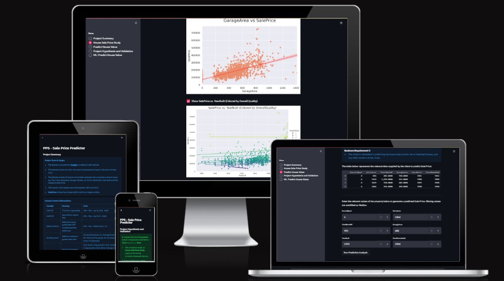
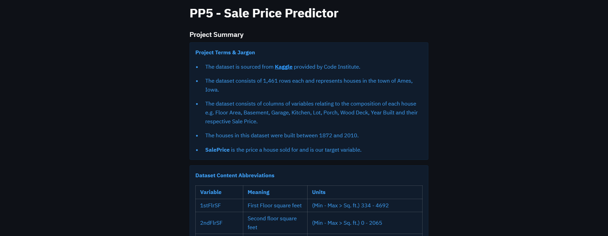
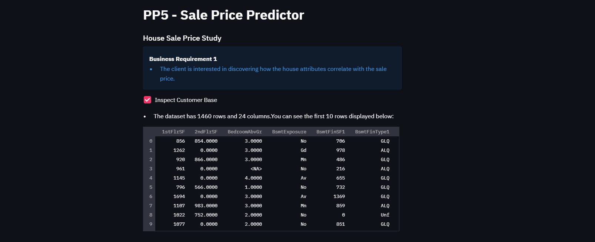
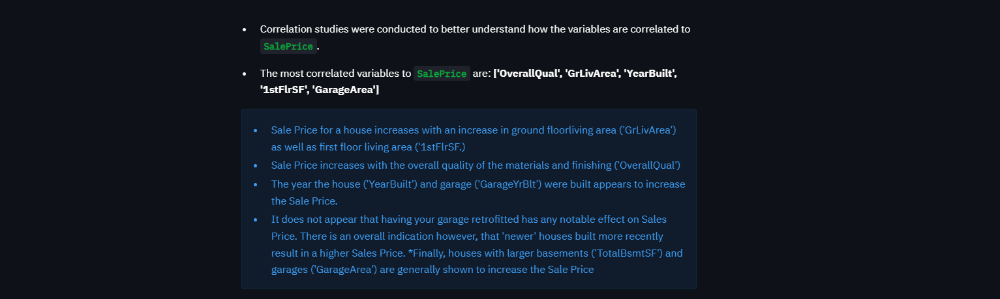
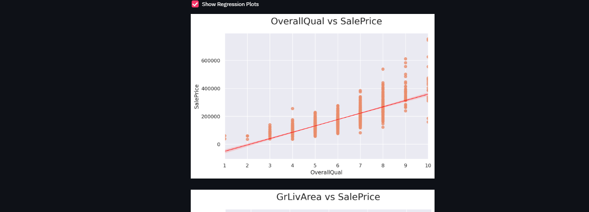
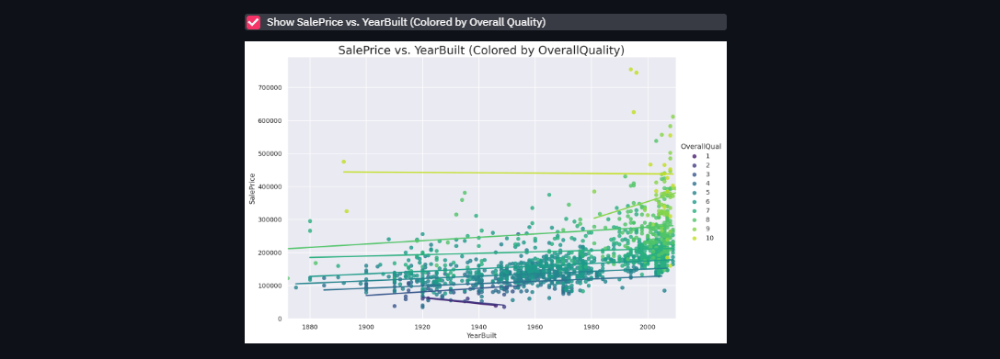

# Predicting Housing Prices 

Link to the [live dashboard](https://pp5-heritage-housing-b229271be179.herokuapp.com/) 

This is my 5th Portfolio Project submission for Code Institute's Diploma in Full Stack Development course as part of my specialization module 'Predictive Analytics'.

This project is based on a fictional and hypothetical situation and client. The housing price predictor featured in the dashboard app should not be relied on in the prediction of any actual houses.

---

## Contents

* [Dataset Content](#dataset-content)

* [Business Requirements](#business-requirements)

* [Hypothesis and How To Validate](#hypothesis-and-how-to-validate)

* [Rationale](#rationale)

* [ML Business Case](#ml-business-case)

* [Dashboard Design](#dashboard-design)

* [Unfixed Bugs](#unfixed-bugs)

* [Deployment](#deployment)

* [Data Analysis and ML Libraries](#data-analysis-and-ml-libraries)

* [Credits and Acknowledgments](#credits-and-acknowledgments)

## Dataset Content

The dataset is sourced from [Kaggle](https://www.kaggle.com/datasets/codeinstitute/housing-prices-data). 

The dataset has almost 1.5 thousand rows and represents housing records from Ames, Iowa, indicating house profiles (Floor Area, Basement, Garage, Kitchen, Lot, Porch, Wood Deck, Year Built) and their respective sale price. 

The dataset includes data for houses built between 1872 and 2010 exclusively in Ames, Iowa.

The dataset's variable names, meanings and units can be inspected below: 
 

|Variable|Meaning|Units|
|:----|:----|:----|
|1stFlrSF|First Floor square feet|334 - 4692|
|2ndFlrSF|Second-floor square feet|0 - 2065|
|BedroomAbvGr|Bedrooms above grade (does NOT include basement bedrooms)|0 - 8|
|BsmtExposure|Refers to walkout or garden level walls|Gd: Good Exposure; Av: Average Exposure; Mn: Minimum Exposure; No: No Exposure; None: No Basement|
|BsmtFinType1|Rating of basement finished area|GLQ: Good Living Quarters; ALQ: Average Living Quarters; BLQ: Below Average Living Quarters; Rec: Average Rec Room; LwQ: Low Quality; Unf: Unfinshed; None: No Basement|
|BsmtFinSF1|Type 1 finished square feet|0 - 5644|
|BsmtUnfSF|Unfinished square feet of basement area|0 - 2336|
|TotalBsmtSF|Total square feet of basement area|0 - 6110|
|GarageArea|Size of garage in square feet|0 - 1418|
|GarageFinish|Interior finish of the garage|Fin: Finished; RFn: Rough Finished; Unf: Unfinished; None: No Garage|
|GarageYrBlt|Year garage was built|1900 - 2010|
|GrLivArea|Above grade (ground) living area square feet|334 - 5642|
|KitchenQual|Kitchen quality|Ex: Excellent; Gd: Good; TA: Typical/Average; Fa: Fair; Po: Poor|
|LotArea| Lot size in square feet|1300 - 215245|
|LotFrontage| Linear feet of street connected to property|21 - 313|
|MasVnrArea|Masonry veneer area in square feet|0 - 1600|
|EnclosedPorch|Enclosed porch area in square feet|0 - 286|
|OpenPorchSF|Open porch area in square feet|0 - 547|
|OverallCond|Rates the overall condition of the house|10: Very Excellent; 9: Excellent; 8: Very Good; 7: Good; 6: Above Average; 5: Average; 4: Below Average; 3: Fair; 2: Poor; 1: Very Poor|
|OverallQual|Rates the overall material and finish of the house|10: Very Excellent; 9: Excellent; 8: Very Good; 7: Good; 6: Above Average; 5: Average; 4: Below Average; 3: Fair; 2: Poor; 1: Very Poor|
|WoodDeckSF|Wood deck area in square feet|0 - 736|
|YearBuilt|Original construction date|1872 - 2010|
|YearRemodAdd|Remodel date (same as construction date if no remodelling or additions)|1950 - 2010|
|SalePrice|Sale Price|34900 - 755000|

## Business Requirements

Our client 'Lydia Doe' who is based in Belgium, has inherited four houses located in Ames, Iowa, from their great-grandfather. They are requesting help to maximise the sales price for these properties.

1 - The client is interested in discovering how the house attributes correlate with the sale price. Therefore, the client expects data visualisations of the correlated variables against the sale price to show that.

2 - The client is interested in predicting the house sale price from her four inherited houses and any other house in Ames, Iowa.

## Hypothesis and How To Validate

List here your project hypothesis(es) and how you envision validating it (them).

1.  Houses that have the greatest overall Living Space would have a higher SalePrice

* Correlation Study

2. Newer builds have a better Overall Quality in terms of finishings and materials which in turn increases SalePrice.

* Correlation Study

3. Houses with more storeys have a higher SalePrice.

* Create a binary variable and plot 2nd storey ownership against single storey.

4. Houses with larger Square Foot of Basement space generally have a higher Sale Price. 

* Correlation Study

## Rationale

**Business Requirement 1:** Data Visualisation and Correlation Study

* As a data analyst, I want to inspect the data related to the house records so that I can discover how the house attributes correlate with the sale price

* As a data analyst, I want to conduct a correlation study (Pearson and Spearman) to understand better how the variables are correlated to Sale Price so that I can discover how the house attributes correlate with the sale price

* As a data analyst, I want to plot the main variables against Sale Price to visualize insights so that I can discover how the house attributes correlate with the sale price.

**Business Requirement 2:** House Price Prediction

* As a client, I want to predict the sale price for a given house in Ames, Iowa.  

The rationale to map the business requirements to the Data Visualisations and ML tasks

List your business requirements and a rationale to map them to the Data Visualisations and ML tasks.

## ML Business Case

In the previous bullet, you potentially visualised an ML task to answer a business requirement. You should frame the business case using the method we covered in the course.

1. What are the business requirements?

* The client is interested in discovering how house attributes correlate with sale prices. Therefore, the client expects data visualizations of the correlated variables against the sale price.

* The client is interested in predicting the house sale prices from her 4 inherited houses, and any other house in Ames, Iowa.

2. Is there any business requirement that can be answered with conventional data analysis?

Yes, we can use conventional data analysis to investigate how house attributes are correlated with the sale prices.

3. Does the client need a dashboard or an API endpoint?

The client needs a dashboard

4. What does the client consider as a successful project outcome?

* A study showing the most relevant variables correlated to sale price.

* Also, a capability to predict the sale price for the 4 inherited houses, as well as any other house in Ames, Iowa.

5. Can you break down the project into Epics and User Stories?

* Information gathering and data collection.
* Data visualization, cleaning, and preparation.
* Model training, optimization and validation.
* Dashboard planning, designing, and development.
* Dashboard deployment and release.

6. Are there Ethical or Privacy concerns?

No. The client found a public dataset.

7. Does the data suggest a particular model?

The data suggests a regressor where the target is the sale price.

8. What are the model's inputs and intended outputs?

The inputs are house attribute information and the output is the predicted sale price.

9. What are the criteria for the performance goal of the predictions?

We agreed with the client an R2 score of at least 0.75 on the train set as well as on the test set.

10. How will the client benefit?

The client will maximize the sales price for the inherited properties.

## Dashboard Design

List all dashboard pages and their content, either blocks of information or widgets, like buttons, checkboxes, images, or any other items that your dashboard library supports.

### Page 1 
### Project Summary
* Project Terms & Jargon
* Describe Project Dataset
* State Business Requirements

The Project Summary page outlines the project's terminology and jargon, provides a description of the dataset, and details the business requirements. Users can gain a comprehensive overview of the project here, along with access to the readme file and a link to the dataset on Kaggle.

The variable for the dataset are explained in detail:

### Page 2
### Sale Price Study
* Initially, our goal for this page was to fulfill Business Requirement 1, though the specific plots to be featured were undetermined until after analysis. 

* After data analysis, the client agreed that the page will show: 

    * data inspection on house attributes
    
    

    * highlight the most correlated/relevant variables to Sale Price and the conclusions
    
    

    * include individual plots showing these
    
    
    
    * other relevant plots highlight relationship to Sale Price

    

## Unfixed Bugs

Upon deployment, Heroku no longer supports the Python version 3.8 in it's Heroku-22 stack. 

The stack was manually changed in the terminal to Heroku-20 using the following command: `heroku stack:set heroku-20 -a your-project-name`

However this will become obsolete on 24th December 2024 so will need to be fixed.

* Many functions developed by Code Institute's team were used in my project to conduct analysis and explore the data. They did not result in any bugs except when I would enter the wrong data type or misspell a variable name.

* One 'bug' I encountered when training my ML model was using too many parameters which resulted in a potential 9 and a half day wait time to see the results for my ExtraTreesRegressor model! I changed my approach to exploring the various parameters using the documentation but only applying 5-6 parameters at a time instead of my inital 25.

## Deployment

The main branch of this repository has been used for the deployed version of this application.

### Using Github & CodeAnywhere

This data application was adapted from the [Code Institute Full Template](https://github.com/Code-Institute-Solutions/milestone-project-heritage-housing-issues).

- Click the `Use This Template` button.
- Add a repository name and brief description.
- Click the `Create Repository from Template` to create your repository.
- Then login in to Code Anywhere and set up a new workspace using the repository URL.
-  Commit your work often and have clear/explanatory messages, use the following commands to make your commits:
    - `git add .`: adds all modified files to a staging area
    - `git commit -m "A message explaining your commit"`: commits all changes to a local repository.
    - `git push`: pushes all your committed changes to your Github repository.

### Heroku

* The App live link is: [live link](https://pp5-heritage-housing-b229271be179.herokuapp.com/)
* Set the runtime.txt Python version to a [Heroku-20](https://devcenter.heroku.com/articles/python-support#supported-runtimes) stack currently supported version.
* The project was deployed to Heroku using the following steps.

1. Log in to Heroku and create an App
2. At the Deploy tab, select GitHub as the deployment method.
3. Select your repository name and click Search. Once it is found, click Connect.
4. Select the branch you want to deploy, then click Deploy Branch.
5. The deployment process should happen smoothly if all deployment files are fully functional. Click the button Open App on the top of the page to access your App.

## Data Analysis and ML Libraries

* [Pandas](https://pandas.pydata.org/) for data analysis, exploration, manipulation and visualization e.g.e create dataframes throughout the Jupyter Notebooks
* [NumPy](https://numpy.org/) was used to process arrays and data 
* [Matplotlib](https://matplotlib.org/) for graphs and plots
* [Seaborn](https://seaborn.pydata.org/) to visualize the data in the Streamlit app with graphs and plots
* [ML: Scikit-learn](https://scikit-learn.org/stable/) used when creating the ML pipeline, applying algorithms and feature engineering

## Credits and Acknowledgments

### Content

* This project was adapted from Code Institute's ['Churnometer'](https://github.com/Code-Institute-Solutions/churnometer) walkthrough project.

### Media

* Media are screenshots from my notebooks and dashboard.

## Credits 

* [Alexander Hess](https://youtu.be/VSeGseoJsNA?feature=shared) walkthrough videos helped to deepen my understanding of data manipulation and inspired me to plot binary variables in my 3rd JupyTer notebook.
* The #project-portfolio-5-predictive-analytics
slack channel was a wealth of information.
* My mentor for this project Marcel who greatly helped me in planning this project.
* Code Institute Alumni [Vasilica Pavaloi](https://github.com/Vasi012/PP5-Predictive-Analysis/tree/main) and [Vanessa Andersson](https://github.com/van-essa) who's projects inspired me throughout this process.
